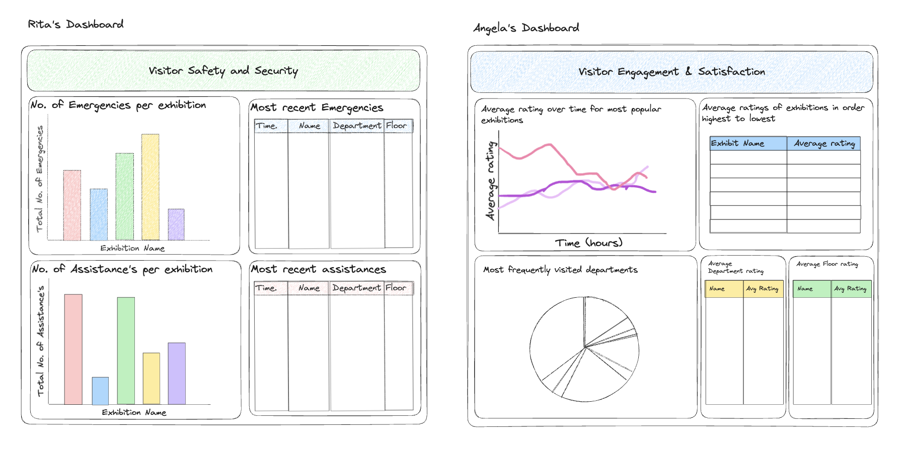

# Project Details

This project takes data from a museum and returns it in a readable way. Creating visual graphs in a Tableau dashboard to help interpretation. Each Dashboard is customised to the users needs. E.g. Rita's dashboard shows emergency and assistance information as she is the head of visitor safety & security. Angela's dashboard shows visitor ratings and satisfaction related data as she is the exhibition manager who is focussed on increasing visitor engagement and satisfaction.

An example dashboard for each person is shown here:

## Kafka_pipeline

Extracts data from a kafka cluster and goes through the code to check if the message is valid. 

1. Extracts data from kafka museum cluster. 
2. Cleans and transforms the data.
3. Loads the data to a remote database using AWS RDS. 

## Installation and Instructions

1. Create a new virtual environment and enter into it. 
2. Run `pip3 install - requirements.txt`.
3. Install Docker.
4. Create an AWS RDS.
5. Create a `.env` file with the below credentials.
5. Connect to your RDS and create tables: `psql -h *your RDS endpoint* -U postgres *database name* -f schema.sql`.
6. Run `python3 kafka_pipeline.py` to start sorting data. 
7. Create an EC2 instance in AWS. 
8. Connect to EC2 instance. 
9. Git clone the repository into the instance. 
10. **Remember to create a new `.env` file as it will not be cloned across.**
11. Run `python3 kafka_pipeline.py` - if you want the script to be a non-closing background task run `nohup python3 kafka_pipeline.py` instead. 
12. Log into your RDS: `psql -h *your RDS endpoint* -U postgres *database name*`.
13. You should now see data being continuously stored in your database (if the confluent_kafka stream is running).

## Required env variables:

- BOOTSTRAP_SERVERS
- SECURITY_PROTOCOL
- SASL_MECHANISM
- USERNAME
- PASSWORD
- GROUP
- AUTO_OFFSET
- TOPIC
- AWS_ACCESS_KEY
- AWS_SECRET_ACCESS_KEY
- BUCKET_NAME
- DATABASE_NAME
- DATABASE_HOST
- DATABASE_USER
- DATABASE_PASSWORD
- DATABASE_PORT

- Database setup:

- Ensure AWS CLI installed
- Ensure Terraform CLI installed

## Files explained

`consumer.py` - connects to the consumer and checks if the message is valid. 
`pipeline` - creates a pipeline to the RDS database set up and stores messages.
`schema.sql` - creates the tables required in the database. 
`errors.txt` - stores error messages if the message is invalid. 
`test_museum_pipeline.py` - tests `kafka_pipeline.py & consumer.py` is working as intended. 
`reset_database.sh` - script to reset the database. 
`requirements.txt` - contains all of the required modules for the code to run successfully. 
